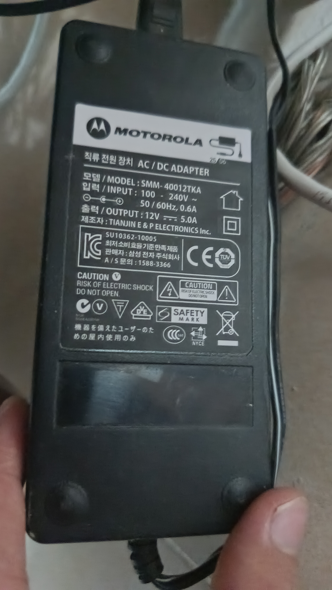
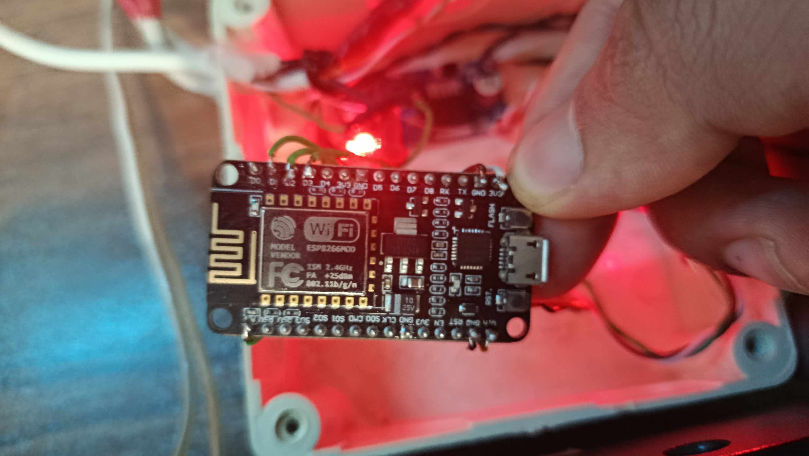
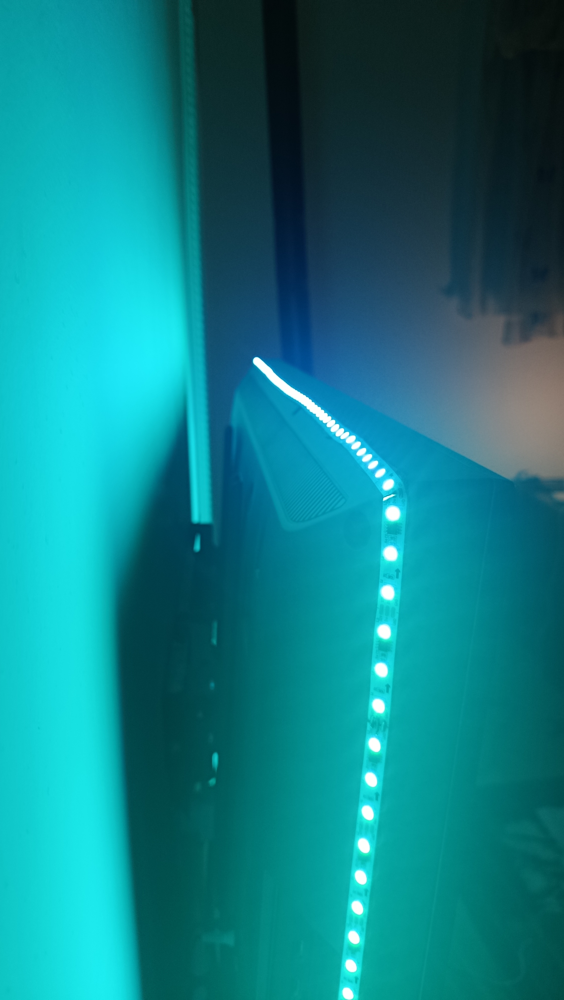
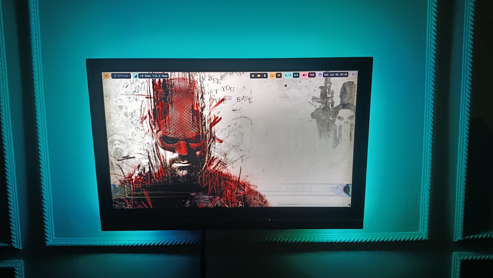
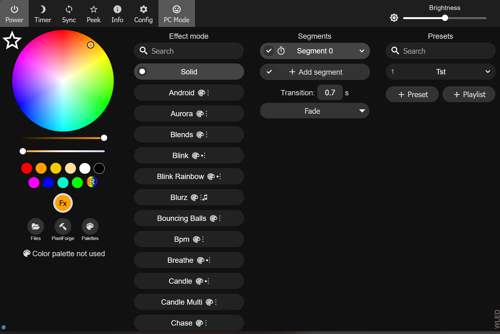

# WLED Ambilight & Equalizer for TV

A simple DIY project I built using a NodeMCU ESP8266, WS2812B LEDs and WLED to create an Ambilight and audio-reactive lighting system for my TV.

The project was completed in less than 24 hours and was mainly built for learning and experimenting with addressable LEDs, WLED and screen-reactive lighting.

---

## Demo

### Ambilight Mode

https://drive.google.com/file/d/1IjjZe9JuRyiNSOZ7kW9rRZ--AscH4l0k/view?usp=drive_link
Uploading InShot_20260607_161602040.mp4…

### Audio Reactive / Equalizer Mode

https://drive.google.com/file/d/1-N6sB9vBnJbN9XQKedMcX9D05hrH6lF1/view?usp=drive_link
---

## Components

* NodeMCU ESP8266
* WS2812B LED Strip
* 12V 5A Switching Adapter
* TV
* USB Cable

---

## Software

* WLED
* Prismatik

Useful links:

WLED Documentation:
https://kno.wled.ge/

WLED GitHub:
https://github.com/wled/WLED

Prismatik Releases:
https://github.com/psieg/Lightpack/releases

Prismatik is an open-source screen capture software that can send colors from your display to WLED devices for Ambilight effects.

---

## Photos

### Power Supply

### NodeMCU ESP8266

### LED Strip

### Final Setup

### WLED Interface

---

## Wiring

My wiring setup was very simple:

WS2812B -> ESP8266

* DIN -> D4 (GPIO2)
* GND -> GND
* VCC -> Power Supply

ESP8266

* Powered through USB

Important:
Make sure the ESP8266 GND and LED strip GND are connected together.

### Wiring Diagram

Power Supply (+) ------> LED VCC

Power Supply (-) ------> LED GND

LED DIN -------------> ESP8266 D4

ESP8266 GND ---------> LED GND

---

## Installation

### 1. Flash WLED

Install WLED on the ESP8266.

### 2. Connect LEDs

Connect the LED strip according to the wiring above.

### 3. Configure WLED

Open the WLED web interface and:

* Connect to WiFi
* Set LED count
* Select GPIO pin

### 4. Install Prismatik

Download and install Prismatik.

### 5. Configure Screen Zones

Create screen capture zones around your display.

### 6. Connect Prismatik to WLED

Set the WLED device IP address inside Prismatik.

### 7. Test

Play a movie, game or music and verify that the LEDs react correctly.

---

## Challenges

Some problems I faced during the project:

* Cable management behind the TV
* LED placement
* Prismatik setup
* Getting smooth Ambilight behavior

Most of them were solved through testing and adjusting settings.

---

## What I Learned

* ESP8266 basics
* WLED configuration
* Addressable LEDs
* Ambilight systems
* Network device control
* Project documentation

---

## Future Improvements

* Better cable management
* Custom enclosure for the ESP8266
* More advanced audio-reactive effects
* Better mounting system

---

This was a fun project and a great way to learn more about WLED, ESP8266 and addressable LEDs.
